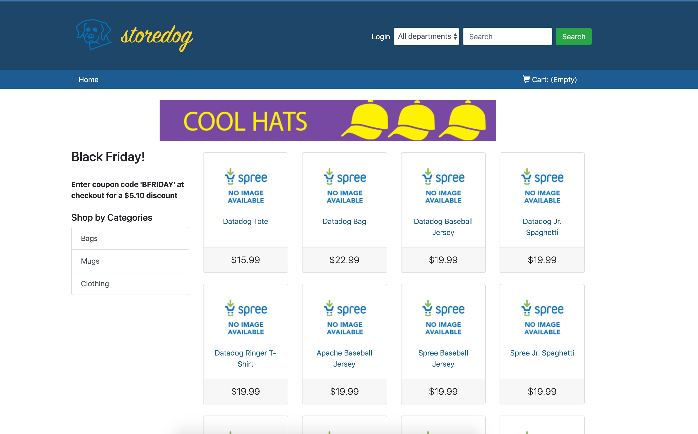

# Up and Running

Let's get the app started by running `application_start`{{execute T1}} in our first Terminal window.

Once it starts the app, click on "storedog" next to the Terminal window to the right or visit https://[[HOST_SUBDOMAIN]]-3000-[[KATACODA_HOST]].environments.katacoda.com/

It should look something like this:

Now that it's up and running, let's simulate some traffic with `generate_traffic`{{execute T2}} in a new terminal window.

Once that is running, please let the instructor know you are ready for the next step.
